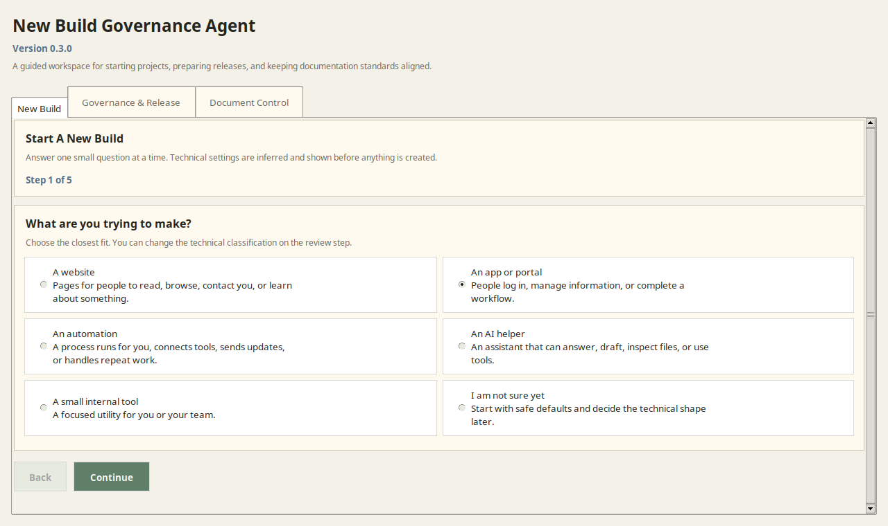

# New Build Governance Agent

**Start an AI-assisted software project with governed scaffolding, practical agent guidance, engineering standards, and update-safe tooling already in place.**

New Build Governance Agent is a starter framework for projects built with AI coding assistants such as Claude, Codex, Cursor, and local agents. It gives you a terminal launcher, a desktop GUI, reusable governance and guidance templates, validation scripts, context-budget guidance, and a staged release model so a new build starts with clear scope, clear ownership, durable engineering standards, and practical agent handoff habits.

## Public Project Snapshot

- **Audience:** builders who want AI-assisted projects to start with clear scope, safety rails, and durable handoff files.
- **Best for:** new applications, internal tools, local agents, automation projects, and repos that need a lightweight governance baseline before they grow.
- **Primary workflow:** run the guided intake, generate a governed project scaffold, then use the included checks and docs to keep future agent sessions focused.
- **License:** MIT. You can use, modify, and adapt the framework in your own projects.
- **Contributions:** issues and pull requests are welcome when they preserve the practical, low-friction governance model. See [CONTRIBUTING.md](CONTRIBUTING.md).

Use it when you want to:

- create a new governed project from six guided questions
- give AI agents consistent instructions and context-hygiene guidance before they write code
- add governance files to an existing repo without overwriting product files
- share durable engineering, ship-readiness, context routing, and token-friendly best practices across builds
- check whether a repo is ready for release, GitHub publishing, or external deployment
- keep Windows, macOS, and Linux users on the same setup path



The desktop GUI walks users through one decision at a time, then shows the technical settings before anything is created. The generated project files give agents a standards map, durable development policy, ship-readiness gate, compact context map, and context hygiene guidance for scoped reads, budget classes, compaction, and handoffs.

## Start Here

| I want to... | Use this link |
|---|---|
| Install or run the agent for the first time | [Installation and setup](INSTALL.md) |
| Try it on Windows without setting up Git yet | [Windows EXE download](#windows-exe-download) |
| Create a new governed project | [Quick start](#quick-start) |
| Pick the right command for Windows, macOS, or Linux | [Download / Use By Operating System](#download--use-by-operating-system) |
| Understand day-to-day workflows | [User guide](docs/user-guide.md) |
| See the governance flow before using it | [Quick-start governance flow](docs/quick-start-governance-flow.md) |
| Route agent context without bloating startup | [Context map](docs/context-map.md) |
| Look up automation commands | [Automation scripts reference](automation/README.md) |
| Review the active roadmap and handoff | [Current build pathway](docs/current-build-pathway.md) |
| Review release and deployment expectations | [Deployment guide](docs/deployment-guide.md) |

---

## Download / Use By Operating System

On GitHub, Windows users can use the release download. Developers can use the green **Code** button.

Use **git clone** for normal development, update checks, and guarded self-updates. Use the Windows release ZIP for a double-click GUI experience. Use **Code** -> **Download ZIP** only for a source-code trial, because a source ZIP is not connected to an upstream branch and cannot self-update later.

| Operating system | Download to use | First run | GUI | Validate | Update later |
|---|---|---|---|---|---|
| Windows | **Releases** -> `NewBuildGovernanceAgent-Windows.zip` for non-technical users. Developers can also clone with Git for Windows. | Double-click `NewBuildGovernanceAgent.exe`, or run `.\automation\new_build.ps1` | Double-click `NewBuildGovernanceAgent.exe`, or run `.\automation\launch_gui.ps1` | `.\scripts\validate.ps1` | `py -3 automation\update_check.py` then `.\automation\new_build.ps1 -SelfUpdate` from a cloned checkout |
| macOS | **Code** -> copy HTTPS URL, then `git clone`. For a one-time trial only, **Code** -> **Download ZIP**. | `bash automation/new_build.sh` | `bash automation/launch_gui.sh` | `bash scripts/validate.sh` | `python3 automation/update_check.py` then `python3 automation/self_update.py` |
| Linux | **Code** -> copy HTTPS URL, then `git clone`. For a one-time trial only, **Code** -> **Download ZIP**. | `bash automation/new_build.sh` | `bash automation/launch_gui.sh` | `bash scripts/validate.sh` | `python3 automation/update_check.py` then `python3 automation/self_update.py` |

Clone command for all operating systems:

```bash
git clone https://github.com/Adamgdwn/new-build-governance-agent.git
cd new-build-governance-agent
```

Windows users should run commands in PowerShell from the cloned repo folder. macOS/Linux users should run commands in a terminal from the cloned repo folder.

The self-update path is guarded. It only updates a clean cloned checkout when Git can fast-forward the current branch from its upstream. It does not reset, stash, rebase, force-pull, change branches, or overwrite local work.

## Windows EXE Download

For non-technical Windows users, use the release package:

1. Open the GitHub **Releases** page.
2. Download `NewBuildGovernanceAgent-Windows.zip`.
3. Unzip it.
4. Double-click `NewBuildGovernanceAgent.exe`.

The `.exe` opens the desktop GUI and uses the same safe launcher scripts under the hood. If something is missing, it shows a Windows error dialog instead of requiring the user to debug PowerShell.

The Windows package also includes these scripts for technical users:

- `automation\new_build.ps1` starts the terminal guided intake.
- `automation\launch_gui.ps1` opens the desktop GUI.
- `scripts\validate.ps1` runs the Windows validation path.

For normal development and guarded self-updates, use **git clone** instead. The self-update commands need a cloned checkout with an upstream branch; they cannot update a release ZIP or source ZIP copy.

Build the Windows package from source on Windows with:

```powershell
.\scripts\build-windows-launcher.ps1
```

---

## What it does

You run one command. You answer six questions. You get this:

```
my-app/
├── README.md
├── START_HERE.md             ← first file for agents; current plan and handoff pointer
├── CLAUDE.md                 ← instructions for Claude / any AI assistant
├── AGENTS.md                 ← multi-agent coordination rules
├── AI_BOOTSTRAP.md           ← canonical rules loaded at the start of every session
├── INITIAL_SCOPE.md          ← timestamped intake answers + first-session checklist
├── project-control.yaml      ← governance level, risk tier, owner, project type, controls
├── docs/
│   ├── architecture.md
│   ├── context-map.md       ← short routing map for agent context loads
│   ├── current-build-pathway.md ← live chunked build route and validation log
│   ├── domain-language.md   ← shared vocabulary across code, docs, tests, UI, prompts
│   ├── policy/durable-development-engineering-policy.md ← code health, testing, security, release standards
│   ├── standards/README.md  ← standards map for coding and release sessions
│   ├── standards/engineering-governance-by-use-case.md ← controls by project use case
│   ├── standards/ship-ready-engineering-standard.md ← Ready/Done/Shipped evidence gate
│   ├── standards/context-hygiene-standard.md ← context, token, compaction, and handoff hygiene
│   ├── adr/                  ← Architecture Decision Records
│   ├── specs/
│   ├── runbooks/
│   ├── risks/risk-register.md
│   ├── CHANGELOG.md
│   ├── deployment-guide.md
│   └── exception-record-template.md
├── scripts/
│   └── governance-preflight.sh
└── archive/
```

AI agent projects get additional scaffolding: agent inventory, model registry, prompt register, and tool permission matrix.

---

## Quick start

Choose the command for your operating system, then answer the guided intake questions.

Linux/macOS terminal:

```bash
bash automation/new_build.sh
```

Windows PowerShell:

```powershell
.\automation\new_build.ps1
```

Windows desktop GUI:

```powershell
.\automation\launch_gui.ps1
```

Linux/macOS desktop GUI:

```bash
bash automation/launch_gui.sh
```

Check the installed version:

```bash
python3 automation/version.py
```

```powershell
py -3 automation\version.py
```

Check whether this checkout is current with GitHub releases or version tags:

```bash
python3 automation/update_check.py
```

```powershell
py -3 automation\update_check.py
```

Safely fast-forward a clean checkout from its upstream branch:

```bash
python3 automation/self_update.py --dry-run
python3 automation/self_update.py
```

```powershell
py -3 automation\self_update.py --dry-run
.\automation\new_build.ps1 -SelfUpdate
```

Full setup instructions: [INSTALL.md](INSTALL.md)

---
## Current State

The framework now does more than bootstrap new projects. It can also detect existing projects in `~/code`, classify them as `governed` or `candidate`, guide them into compliance, and prepare staged external rollout plans without auto-pushing changes.

Current capabilities:

- create new governed projects from the terminal or desktop GUI
- scaffold compact context maps, budget classes, and token-friendly agent instructions
- register and audit governed projects across `~/code/agents` and `~/code/Applications`
- detect older repos as candidate projects from real project signals
- generate and apply conservative compliance manifests that add missing governance files and append marked instruction guidance
- generate staged promotion plans for GitHub, Vercel, Supabase, Stripe, and Resend
- run guided pre-promotion checks from the GUI
- repair missing local test tooling such as `pytest` from the GUI and rerun checks automatically
- execute the approved GitHub publish step with rollback metadata and a saved execution report

The desktop GUI now includes:

- `Create` for new project setup
- `Governance & Release` for compliance previews, local updates, release planning, checks, and GitHub publish

---

## Verified So Far

The following workflows were exercised successfully during this session:

- `frogger` was created as a new governed project under `~/code/Applications`
- `bowtie_risk_program` was detected as a candidate project
- a conservative doc-only upgrade was applied first (`manual` and `roadmap`)
- `bowtie_risk_program` was then promoted into the governed baseline without overwriting product files
- governance preflight passed after promotion
- staged pre-promotion checks passed after repairing local dependency state

Important real-world findings from the test:

- candidate promotion must add the full governance spine, not just `manual` and `roadmap`
- desktop-launched checks cannot assume a full shell environment, so the runner now provides its own `PATH` and `GOVERNANCE_HOME`
- existing projects may fail checks for real dependency reasons; in `bowtie_risk_program`, `node_modules/.bin` had lost executable bits and `npm install` was needed to restore the native `lightningcss` package

---

## Promotion Model

The framework now treats promotion as staged and reviewable:

1. local compliance
2. pre-promotion checks
3. external sync planning
4. explicit per-target approval
5. post-promotion checks
6. rollback readiness

External targets currently modeled in the plan:

- GitHub
- Vercel
- Supabase
- Stripe
- Resend

External execution is still intentionally blocked by default. The framework prepares plans and checks first.

---

## Resume Point

Good next steps for the next session:

- add `Run Post-Checks` to the GUI using the same promotion-check runner
- tailor promoted governance docs to the real repo where possible instead of leaving only generic template content
- continue sharpening the compliance UI as the manifest workflow expands
- begin cleanup of redundant prototype repos and stale files only after the current path stays stable

If you are resuming work later, start here:

- automation reference: [automation/README.md](automation/README.md)
- staged rollout model: [docs/processes/staged-promotion-workflow.md](docs/processes/staged-promotion-workflow.md)
- consolidation plan: [docs/processes/new-build-governance-agent-consolidation-plan.md](docs/processes/new-build-governance-agent-consolidation-plan.md)

---

## The six questions

| Question | Options |
|----------|---------|
| Project name | free text — auto-slugified for the directory name |
| Build type | `app` / `agent` / `tool` / `other` |
| Expected stack | free text |
| Primary builder model | `claude` / `codex` / `local` / `hybrid` |
| Governance level | `0` full autonomy through `4` critical controls |
| Capture scope brief now? | `yes` — records problem, user, MVP in `INITIAL_SCOPE.md` |

---

## How it works

```mermaid
flowchart TD
    A([Launch]) --> B{Interface}
    B -->|Terminal| C["bash automation/new_build.sh"]
    B -->|Desktop GUI| D["automation/launch_gui.sh"]
    C & D --> E

    subgraph intake [" Step 1 — Intake "]
        E["Project name\nfree text · auto-slugified to directory name"] --> F

        F{Build type} -->|app| F1[application]
        F -->|agent| F2[agent]
        F -->|tool| F3[internal-tool]
        F -->|other| F4[automation]

        F1 & F2 & F3 & F4 --> G

        G["Stack\nfree text description of your tech stack\ne.g. python / fastapi   react / node   not specified"] --> H

        H["Builder model\nclaude · codex · local · hybrid\nRecorded in project-control.yaml and INITIAL_SCOPE.md"] --> I

        I{Governance level} -->|0-1| I1[risk_tier: low]
        I -->|2| I2[risk_tier: medium]
        I -->|3| I3[risk_tier: high]
        I -->|4| I4[risk_tier: critical]

        I1 & I2 & I3 & I4 --> J

        J{Capture scope brief now?} -->|yes| K["Problem statement\nPrimary user or consumer\nMVP description\nWritten to INITIAL_SCOPE.md"]
        J -->|no| L[Skip — fill in before first session]
    end

    K & L --> M

    subgraph routing [" Step 2 — Route "]
        M["Slugify name\nlowercase · spaces and underscores become dashes"] --> N{Type}
        N -->|agent| O["~/code/agents/slug/"]
        N -->|"app · tool · other"| P["~/code/Applications/slug/"]
    end

    O & P --> Q

    subgraph confirm [" Step 3 — Confirm "]
        Q{Directory\nalready exists?} -->|yes| R["Warn: existing files\nwill not be overwritten"]
        Q -->|no| S["Show plan\nname · type · governance level · risk tier · full path"]
        R --> S
        S -->|no| T([Abort — nothing written])
        S -->|yes| U[Proceed]
    end

    U --> V

    subgraph scaffold [" Step 4 — bootstrap_project.sh "]
        V["Copy templates\ncopy-if-missing — safe on existing projects"] --> W["Core files\nREADME · CLAUDE · AGENTS · AI_BOOTSTRAP\nproject-control.yaml\ndocs: architecture · durable engineering policy · risk-register · CHANGELOG\nadr-template · exception-record-template\ndeployment-guide · runbook\nscripts/governance-preflight.sh"]
        W --> X["Patch project-control.yaml\nproject name · type · governance level · risk tier"]
        X --> Y{Agent project?}
        Y -->|yes| Z["Add agent-specific docs\nagent-inventory · model-registry\nprompt-register · tool-permission-matrix"]
        Y -->|no| AA[Standard doc set only]
    end

    Z & AA --> AB

    subgraph post [" Step 5 — Post-scaffold "]
        AB["Create extra directories\ndocs/adr · docs/specs · docs/runbooks · archive"] --> AC["Fill project-control.yaml\nowner name · builder model"]
        AC --> AD["Write INITIAL_SCOPE.md\nclassification table · build approach\nscope brief · first-session checklist"]
    end

    AD --> AE([Project ready\nOpen in your editor · fill in AI_BOOTSTRAP.md commands])
```



---

## Why this exists

Starting a project with an AI assistant typically means no structure, no scope record, no clear rules for the AI to follow, and no paper trail of decisions. This framework fixes that from minute zero.

- Every project gets a `CLAUDE.md` / `AI_BOOTSTRAP.md` so the AI knows how to behave in this codebase from the first message.
- `project-control.yaml` records the governance level, risk tier, and owner so you can apply the right level of process.
- `START_HERE.md` gives every agent the same first read and points to `docs/current-build-pathway.md`.
- `INITIAL_SCOPE.md` captures why the project exists before any code is written, with a generated timestamp.
- `docs/current-build-pathway.md` keeps active work in timestamped, context-window-friendly chunks.
- `docs/standards/engineering-governance-by-use-case.md` helps choose controls for the project type without overriding the selected risk tier or governance level.
- `docs/policy/durable-development-engineering-policy.md` sets the default engineering standard for code health, tool choice, testing, security, review, release, operations, and AI-assisted development.
- `docs/standards/README.md` is the standards map future coding sessions should read first when they need the full engineering standard set.
- `docs/standards/ship-ready-engineering-standard.md` separates good code from ship-ready product increments with Definition of Ready, Definition of Done, Definition of Shipped, last-mile UX, security, operations, and evidence checks.
- `governance-preflight.sh` gives you a local check you can run before any significant change.
- New scaffolds also carry `scripts/governance-check.sh`, so the preflight does not depend on `GOVERNANCE_HOME` for a basic local run.

The framework scales with risk — a low-risk internal tool doesn't need the same overhead as a production agent.

---

## What's in the repo

```
automation/
  new_build.sh              Interactive terminal launcher
  new_build.ps1             Windows PowerShell terminal launcher
  new_build_gui.py          Desktop GUI launcher (Python/tkinter, dark theme)
  launch_gui.sh             Desktop-safe wrapper for menu and .desktop launches
  launch_gui.ps1            Windows PowerShell GUI launcher
  scaffold_project.py       Cross-platform scaffolding engine
  bootstrap_project.sh      Shell wrapper around the scaffolding engine
  governance_check.sh       Full governance validator
  check_required_files.sh   Minimal required-file presence check
  new-build-governance-agent.svg       Icon for the desktop launcher

templates/project/          Files copied into every new project
  START_HERE.template.md
  CLAUDE.template.md
  AGENTS.template.md
  AI_BOOTSTRAP.template.md
  README.template.md
  project-control.template.yaml
  scripts/governance-check.template.sh
  scripts/governance-preflight.template.sh
  docs/                     Architecture, current build pathway, ADR, risk register, runbook, changelog, …

docs/                       Framework reference documentation
  policy/                   Engineering governance policy
  standards/                Naming, structure, docs, testing, security, deployment, AI agents
  processes/                Project intake, exception management
  user-guide.md             How to use the framework day-to-day
  quick-start-governance-flow.md

checklists/
  project-setup-checklist.md
  release-readiness-checklist.md
  agent-readiness-checklist.md
```

---

## Requirements

| Requirement | Notes |
|-------------|-------|
| Python 3.8+ | Required for the cross-platform scaffolding engine and GUI |
| tkinter | GUI only; included with the standard Python.org Windows installer |
| PowerShell | Windows launch and validation scripts |
| bash 4+ | Linux/macOS shell launchers; macOS ships bash 3, so install bash via Homebrew if needed |
| sed, awk | Used by legacy shell workflows on Linux/macOS |

Use `automation/new_build.ps1` or `automation/launch_gui.ps1` on Windows. Use `automation/new_build.sh` or `automation/launch_gui.sh` on Linux/macOS.

---

## Docs

- [Installation and setup](INSTALL.md) - first-run setup, requirements, and operating-system notes.
- [User guide](docs/user-guide.md) - practical workflows for creating projects, checking governance, and updating the agent.
- [Quick-start governance flow](docs/quick-start-governance-flow.md) - short visual guide to the preflight and release path.
- [Automation scripts reference](automation/README.md) - command reference for launchers, checks, audits, promotion plans, and updates.
- [Current build pathway](docs/current-build-pathway.md) - active plan, validation log, and handoff notes.
- [Deployment guide](docs/deployment-guide.md) - release expectations and external promotion model.
- [Optional GitHub agent publishing tips](docs/user-guide.md#optional-asking-an-agent-to-commit-and-push) - owner coaching for asking Codex or Claude to commit, push, open PRs, or intentionally push `main`.

---

## License

MIT

## Contributing

Contributions are welcome. Please keep changes focused on making project startup, agent handoff, validation, and release readiness easier to understand and safer to run. See [CONTRIBUTING.md](CONTRIBUTING.md) for the contribution workflow.
