# AI Project Governance Framework

**Scaffold a fully governed, AI-ready project in under 60 seconds.**

A lightweight governance framework for software projects built with AI coding assistants (Claude, Codex, Cursor, etc.). Comes with a New Build Agent — a terminal launcher and desktop GUI — that asks six questions and hands you a structured, documented project directory ready for your first AI session.

---

## What it does

You run one command. You answer six questions. You get this:

```
my-app/
├── README.md
├── CLAUDE.md                 ← instructions for Claude / any AI assistant
├── AGENTS.md                 ← multi-agent coordination rules
├── AI_BOOTSTRAP.md           ← canonical rules loaded at the start of every session
├── INITIAL_SCOPE.md          ← your intake answers + first-session checklist
├── project-control.yaml      ← risk tier, owner, project type, controls
├── docs/
│   ├── architecture.md
│   ├── adr/                  ← Architecture Decision Records
│   ├── specs/
│   ├── runbooks/
│   ├── risks/risk-register.md
│   ├── CHANGELOG.md
│   ├── deployment-guide.md
│   └── exception-record-template.md
├── scripts/
│   └── governance-preflight.sh
└── archive/
```

AI agent projects get additional scaffolding: agent inventory, model registry, prompt register, and tool permission matrix.

---

## Quick start

**Clone:**
```bash
git clone https://github.com/Adamgdwn/ai-project-governance.git
cd ai-project-governance
```

**Edit two lines** in `automation/new_build.sh` to set where projects land on your machine:
```bash
AGENTS_ROOT="${HOME}/code/agents"       # where agent projects go
APPS_ROOT="${HOME}/code/Applications"   # where everything else goes
```

**Run:**
```bash
bash automation/new_build.sh
```

Or launch the desktop GUI:
```bash
python3 automation/new_build_gui.py
```

For a Linux desktop launcher or app-menu entry, use `automation/launch_gui.sh` so paths with spaces and thin desktop environments do not break startup.

Full setup instructions: [INSTALL.md](INSTALL.md)

---
## Current State

The framework now does more than bootstrap new projects. It can also detect existing projects in `~/code`, classify them as `governed` or `candidate`, guide them into compliance, and prepare staged external rollout plans without auto-pushing changes.

Current capabilities:

- create new governed projects from the terminal or desktop GUI
- register and audit governed projects across `~/code/agents` and `~/code/Applications`
- detect older repos as candidate projects from real project signals
- generate and apply conservative promotion manifests that add only missing governance files
- generate staged promotion plans for GitHub, Vercel, Supabase, Stripe, and Resend
- run guided pre-promotion checks from the GUI
- execute the approved GitHub publish step with rollback metadata and a saved execution report

The desktop GUI now includes:

- `Create` for new project setup
- `Change Control` for guided local promotion, external plan generation, checks, and GitHub publish

---

## Verified So Far

The following workflows were exercised successfully during this session:

- `frogger` was created as a new governed project under `~/code/Applications`
- `bowtie_risk_program` was detected as a candidate project
- a conservative doc-only upgrade was applied first (`manual` and `roadmap`)
- `bowtie_risk_program` was then promoted into the governed baseline without overwriting product files
- governance preflight passed after promotion
- staged pre-promotion checks passed after repairing local dependency state

Important real-world findings from the test:

- candidate promotion must add the full governance spine, not just `manual` and `roadmap`
- desktop-launched checks cannot assume a full shell environment, so the runner now provides its own `PATH` and `GOVERNANCE_HOME`
- existing projects may fail checks for real dependency reasons; in `bowtie_risk_program`, `node_modules/.bin` had lost executable bits and `npm install` was needed to restore the native `lightningcss` package

---

## Promotion Model

The framework now treats promotion as staged and reviewable:

1. local compliance
2. pre-promotion checks
3. external sync planning
4. explicit per-target approval
5. post-promotion checks
6. rollback readiness

External targets currently modeled in the plan:

- GitHub
- Vercel
- Supabase
- Stripe
- Resend

External execution is still intentionally blocked by default. The framework prepares plans and checks first.

---

## Resume Point

Good next steps for the next session:

- add `Run Post-Checks` to the GUI using the same promotion-check runner
- tailor promoted governance docs to the real repo where possible instead of leaving only generic template content
- optionally add a `Promote Candidate` label or button in the GUI so the action is more explicit than a generic manifest apply
- begin cleanup of redundant prototype repos and stale files only after the current path stays stable

If you are resuming work later, start here:

- automation reference: [automation/README.md](automation/README.md)
- staged rollout model: [docs/processes/staged-promotion-workflow.md](docs/processes/staged-promotion-workflow.md)
- consolidation plan: [docs/processes/new-build-agent-consolidation-plan.md](docs/processes/new-build-agent-consolidation-plan.md)

---

## The six questions

| Question | Options |
|----------|---------|
| Project name | free text — auto-slugified for the directory name |
| Build type | `app` / `agent` / `tool` / `other` |
| Expected stack | free text |
| Primary builder model | `claude` / `codex` / `local` / `hybrid` |
| Governance level | `normal` (medium risk) / `heavy` (high risk) |
| Capture scope brief now? | `yes` — records problem, user, MVP in `INITIAL_SCOPE.md` |

---

## How it works

```mermaid
flowchart TD
    A([Launch]) --> B{Interface}
    B -->|Terminal| C["bash automation/new_build.sh"]
    B -->|Desktop GUI| D["automation/launch_gui.sh"]
    C & D --> E

    subgraph intake [" Step 1 — Intake "]
        E["Project name\nfree text · auto-slugified to directory name"] --> F

        F{Build type} -->|app| F1[application]
        F -->|agent| F2[agent]
        F -->|tool| F3[internal-tool]
        F -->|other| F4[automation]

        F1 & F2 & F3 & F4 --> G

        G["Stack\nfree text description of your tech stack\ne.g. python / fastapi   react / node   not specified"] --> H

        H["Builder model\nclaude · codex · local · hybrid\nRecorded in project-control.yaml and INITIAL_SCOPE.md"] --> I

        I{Governance level} -->|normal| I1[risk_tier: medium]
        I -->|heavy| I2[risk_tier: high]

        I1 & I2 --> J

        J{Capture scope brief now?} -->|yes| K["Problem statement\nPrimary user or consumer\nMVP description\nWritten to INITIAL_SCOPE.md"]
        J -->|no| L[Skip — fill in before first session]
    end

    K & L --> M

    subgraph routing [" Step 2 — Route "]
        M["Slugify name\nlowercase · spaces and underscores become dashes"] --> N{Type}
        N -->|agent| O["~/code/agents/slug/"]
        N -->|"app · tool · other"| P["~/code/Applications/slug/"]
    end

    O & P --> Q

    subgraph confirm [" Step 3 — Confirm "]
        Q{Directory\nalready exists?} -->|yes| R["Warn: existing files\nwill not be overwritten"]
        Q -->|no| S["Show plan\nname · type · risk tier · full path"]
        R --> S
        S -->|no| T([Abort — nothing written])
        S -->|yes| U[Proceed]
    end

    U --> V

    subgraph scaffold [" Step 4 — bootstrap_project.sh "]
        V["Copy templates\ncopy-if-missing — safe on existing projects"] --> W["Core files\nREADME · CLAUDE · AGENTS · AI_BOOTSTRAP\nproject-control.yaml\ndocs: architecture · risk-register · CHANGELOG\nadr-template · exception-record-template\ndeployment-guide · runbook\nscripts/governance-preflight.sh"]
        W --> X["Patch project-control.yaml\nproject name · type · risk tier"]
        X --> Y{Agent project?}
        Y -->|yes| Z["Add agent-specific docs\nagent-inventory · model-registry\nprompt-register · tool-permission-matrix"]
        Y -->|no| AA[Standard doc set only]
    end

    Z & AA --> AB

    subgraph post [" Step 5 — Post-scaffold "]
        AB["Create extra directories\ndocs/adr · docs/specs · docs/runbooks · archive"] --> AC["Fill project-control.yaml\nowner name · builder model"]
        AC --> AD["Write INITIAL_SCOPE.md\nclassification table · build approach\nscope brief · first-session checklist"]
    end

    AD --> AE([Project ready\nOpen in your editor · fill in AI_BOOTSTRAP.md commands])
```



---

## Why this exists

Starting a project with an AI assistant typically means no structure, no scope record, no clear rules for the AI to follow, and no paper trail of decisions. This framework fixes that from minute zero.

- Every project gets a `CLAUDE.md` / `AI_BOOTSTRAP.md` so the AI knows how to behave in this codebase from the first message.
- `project-control.yaml` records the risk tier and owner so you can apply the right level of process.
- `INITIAL_SCOPE.md` captures why the project exists before any code is written.
- `governance-preflight.sh` gives you a local check you can run before any significant change.

The framework scales with risk — a low-risk internal tool doesn't need the same overhead as a production agent.

---

## What's in the repo

```
automation/
  new_build.sh              Interactive terminal launcher
  new_build_gui.py          Desktop GUI launcher (Python/tkinter, dark theme)
  launch_gui.sh             Desktop-safe wrapper for menu and .desktop launches
  bootstrap_project.sh      Scaffolding engine — safe to run on existing projects
  governance_check.sh       Full governance validator
  check_required_files.sh   Minimal required-file presence check
  new-build-agent.svg       Icon for the desktop launcher

templates/project/          Files copied into every new project
  CLAUDE.template.md
  AGENTS.template.md
  AI_BOOTSTRAP.template.md
  README.template.md
  project-control.template.yaml
  scripts/governance-preflight.template.sh
  docs/                     Architecture, ADR, risk register, runbook, changelog, …

docs/                       Framework reference documentation
  policy/                   Engineering governance policy
  standards/                Naming, structure, docs, testing, security, deployment, AI agents
  processes/                Project intake, exception management
  user-guide.md             How to use the framework day-to-day
  quick-start-governance-flow.md

checklists/
  project-setup-checklist.md
  release-readiness-checklist.md
  agent-readiness-checklist.md
```

---

## Requirements

| Requirement | Notes |
|-------------|-------|
| bash 4+ | macOS ships bash 3 — install bash via Homebrew if needed |
| Python 3.8+ | For `bootstrap_project.sh` internal script and the GUI |
| tkinter | GUI only — `sudo apt install python3-tk` on Debian/Ubuntu |
| sed, awk | Standard on all platforms |

The terminal launcher (`new_build.sh`) works on Linux and macOS. The desktop GUI and `.desktop` launcher are Linux-only.

---

## Docs

- [Installation and setup](INSTALL.md)
- [User guide](docs/user-guide.md)
- [Quick-start governance flow](docs/quick-start-governance-flow.md)
- [Automation scripts reference](automation/README.md)

---

## License

MIT
