# User Guide

This guide covers how to use the framework day-to-day: creating projects, validating governance, customising templates, and understanding what each file does.

---

## Agent flow

```mermaid
flowchart TD
    A([Launch]) --> B{Interface}
    B -->|Terminal| C["bash automation/new_build.sh"]
    B -->|Desktop GUI| D["automation/launch_gui.sh"]
    C & D --> E

    subgraph intake [" Step 1 — Intake "]
        E["Project name\nfree text · auto-slugified to directory name"] --> F

        F{Build type} -->|app| F1[application]
        F -->|agent| F2[agent]
        F -->|tool| F3[internal-tool]
        F -->|other| F4[automation]

        F1 & F2 & F3 & F4 --> G

        G["Stack\nfree text description of your tech stack\ne.g. python / fastapi   react / node   not specified"] --> H

        H["Builder model\nclaude · codex · local · hybrid\nRecorded in project-control.yaml and INITIAL_SCOPE.md"] --> I

        I{Governance level} -->|0-1| I1[risk_tier: low]
        I -->|2| I2[risk_tier: medium]
        I -->|3| I3[risk_tier: high]
        I -->|4| I4[risk_tier: critical]

        I1 & I2 & I3 & I4 --> J

        J{Capture scope brief now?} -->|yes| K["Problem statement\nPrimary user or consumer\nMVP description\nWritten to INITIAL_SCOPE.md"]
        J -->|no| L[Skip — fill in before first session]
    end

    K & L --> M

    subgraph routing [" Step 2 — Route "]
        M["Slugify name\nlowercase · spaces and underscores become dashes"] --> N{Type}
        N -->|agent| O["~/code/agents/slug/"]
        N -->|"app · tool · other"| P["~/code/Applications/slug/"]
    end

    O & P --> Q

    subgraph confirm [" Step 3 — Confirm "]
        Q{Directory\nalready exists?} -->|yes| R["Warn: existing files\nwill not be overwritten"]
        Q -->|no| S["Show plan\nname · type · governance level · risk tier · full path"]
        R --> S
        S -->|no| T([Abort — nothing written])
        S -->|yes| U[Proceed]
    end

    U --> V

    subgraph scaffold [" Step 4 — bootstrap_project.sh "]
        V["Copy templates\ncopy-if-missing — safe on existing projects"] --> W["Core files\nREADME · CLAUDE · AGENTS · AI_BOOTSTRAP\nproject-control.yaml\ndocs: architecture · durable engineering policy · risk-register · CHANGELOG\nadr-template · exception-record-template\ndeployment-guide · runbook\nscripts/governance-preflight.sh"]
        W --> X["Patch project-control.yaml\nproject name · type · governance level · risk tier"]
        X --> Y{Agent project?}
        Y -->|yes| Z["Add agent-specific docs\nagent-inventory · model-registry\nprompt-register · tool-permission-matrix"]
        Y -->|no| AA[Standard doc set only]
    end

    Z & AA --> AB

    subgraph post [" Step 5 — Post-scaffold "]
        AB["Create extra directories\ndocs/adr · docs/specs · docs/runbooks · archive"] --> AC["Fill project-control.yaml\nowner name · builder model"]
        AC --> AD["Write INITIAL_SCOPE.md\nclassification table · build approach\nscope brief · first-session checklist"]
    end

    AD --> AE([Project ready\nOpen in your editor · fill in AI_BOOTSTRAP.md commands])
```



---

## Creating a new project

### Windows and version-update roadmap

Windows support and version updates should be added in small, reviewable chunks. The goal is that a user can clone the repository from GitHub on Windows, run the framework without WSL, and later keep the checkout current without guessing which files or commands matter.

Execution should follow this timestamped chunk ledger:

| Chunk | Scope | Status | Completion timestamp | Notes |
|---:|---|---|---|---|
| 1 | Windows-first launch support | complete | 2026-06-01T11:07:02-06:00 | Added PowerShell entry points, avoided normal-use WSL requirements, normalized first-run paths, and added Windows CI validation. |
| 2 | Version source of truth | complete | 2026-06-01T11:36:57-06:00 | Added `VERSION`, version helper commands, GUI version display, release documentation, and version tests. |
| 3 | Read-only update checks | complete | 2026-06-01T12:00:28-06:00 | Added `automation/update_check.py` and launcher flags that compare local `VERSION` against GitHub releases or semantic version tags; reports current, behind, ahead, or unable to check without changing files. |
| 4 | Guarded self-update | complete | 2026-06-01T12:17:12-06:00 | Added explicit self-update commands that refuse dirty, detached, missing-upstream, ahead, or diverged checkouts and update only by `git merge --ff-only`. |
| 5 | Windows validation hardening | complete | 2026-06-01T12:38:41-06:00 | Expanded `scripts/validate.ps1` with agent-specific required-file checks and Windows launcher smoke tests for version, update-check, and self-update failure reporting. |
| 6 | GUI update affordances | complete | 2026-06-01T13:05:20-06:00 | Added Agent Updates controls to the GUI; the Update button is offered only after a dry-run confirms a safe fast-forward is possible. |
| 7 | Windows EXE package | complete | 2026-06-05T17:37:22-06:00 | Added a reviewable Windows `.exe` launcher, Windows package build script, CI artifact workflow, and tag-based GitHub Release asset publishing. |

Keep this ledger current when a chunk starts or completes. Every completed chunk should have an ISO timestamp from `date -Iseconds` or the Windows equivalent.

### Terminal (Linux/macOS)

```bash
bash automation/new_build.sh
```

### PowerShell (Windows)

```powershell
.\automation\new_build.ps1
```

### Double-click GUI (Windows)

For non-technical Windows users, download `NewBuildGovernanceAgent-Windows.zip` from GitHub Releases, unzip it, and double-click:

```text
NewBuildGovernanceAgent.exe
```

The `.exe` starts the desktop GUI through the same guarded PowerShell launcher used by technical users. It is a launcher for the unpacked package, so keep it in the unzipped folder with the `automation`, `docs`, `scripts`, and `templates` directories.

Build the Windows package from source on Windows:

```powershell
.\scripts\build-windows-launcher.ps1
```

The build creates:

```text
dist\windows\NewBuildGovernanceAgent.exe
dist\NewBuildGovernanceAgent-Windows.zip
```

The launcher walks you through six questions:

1. **Project name** — free text. The directory name is auto-derived (lowercased, spaces become dashes).
2. **Build type** — `app`, `agent`, `tool`, or `other`.
3. **Expected stack** — free text, e.g. `python / fastapi` or `not specified`.
4. **Primary builder model** — `claude`, `codex`, `local`, or `hybrid`. Recorded in `project-control.yaml` and `INITIAL_SCOPE.md`.
5. **Governance level** — choose `0` through `4`, where `0` is full autonomy and `4` is critical controls.
6. **Capture scope brief?** — if `yes`, you answer three more questions (problem, primary user, MVP) and the answers are written into `INITIAL_SCOPE.md`.

Before creating anything, the launcher shows you a confirmation summary. Type `no` to abort with no changes made.

### Desktop GUI

Windows PowerShell:

```powershell
.\automation\launch_gui.ps1
```

Linux/macOS:

```bash
python3 automation/new_build_gui.py
```

Same questions as the terminal version, with a live path preview beneath the project name field. The output panel streams bootstrap progress in real time.

For a desktop menu entry or `.desktop` launcher, use `automation/launch_gui.sh` instead of
calling the Python file directly. The wrapper preserves `PATH`, sets `GOVERNANCE_HOME`, and
handles repo paths that contain spaces more reliably.

### Installed version

The installed version comes from the repository `VERSION` file.

Linux/macOS:

```bash
bash automation/new_build.sh --version
python3 automation/version.py --plain
```

Windows PowerShell:

```powershell
.\automation\new_build.ps1 -Version
py -3 automation\version.py --plain
```

The GUI also shows the installed version in the header.

### Update check

The update check is read-only. It compares the local `VERSION` file against the latest semantic version available from GitHub releases or tags and reports one of:

- `current` — the local version matches the latest published semantic version.
- `behind` — a newer published version exists.
- `ahead` — the local checkout is newer than the latest published semantic version.
- `unable_to_check` — GitHub could not be reached, or no semantic version release/tag exists yet.

Linux/macOS:

```bash
python3 automation/update_check.py
bash automation/new_build.sh --check-updates
python3 automation/new_build_headless.py --check-updates
```

Windows PowerShell:

```powershell
.\automation\new_build.ps1 -CheckUpdates
py -3 automation\update_check.py
```

This command does not pull, merge, reset, checkout, write files, or update the repository.

### Self-update

The self-update command is guarded. It fetches the current branch's upstream remote, then updates only when Git can fast-forward cleanly.

It refuses to update when:

- the working tree has modified, staged, or untracked files
- the checkout is detached
- the current branch has no upstream tracking branch
- the local branch is ahead of its upstream
- the local branch has diverged from its upstream
- Git cannot fetch the upstream remote

Linux/macOS:

```bash
python3 automation/self_update.py --dry-run
python3 automation/self_update.py
bash automation/new_build.sh --self-update
```

Windows PowerShell:

```powershell
py -3 automation\self_update.py --dry-run
.\automation\new_build.ps1 -SelfUpdate
```

The update path uses `git fetch --prune --tags <remote>` followed by `git merge --ff-only <upstream>`. It does not reset, stash, rebase, force-pull, change branches, or overwrite local work.

### GUI update controls

The desktop GUI includes an Agent Updates control in the Governance & Release workflow.

- `Check` runs the version check and a self-update dry run.
- `Update` remains disabled unless the dry run reports `would_update`.
- If the repo is dirty, detached, missing an upstream, ahead, diverged, or already current, the GUI shows the status but does not offer the update action.
- After a successful GUI update, restart the GUI so the running app loads the updated code.

---

## What gets created

Every project receives:

| File | Purpose |
|------|---------|
| `README.md` | Project description (from template — fill in) |
| `START_HERE.md` | First file for agents; current plan and handoff pointer |
| `CLAUDE.md` | Instructions loaded by Claude at the start of every session |
| `AGENTS.md` | Rules for multi-agent coordination |
| `AI_BOOTSTRAP.md` | Canonical project rules for any AI assistant — fill in the Commands section |
| `INITIAL_SCOPE.md` | Timestamped intake answers, classification, and first-session checklist |
| `project-control.yaml` | Governance level, risk tier, owner, project type, and required controls |
| `docs/architecture.md` | Architecture overview |
| `docs/current-build-pathway.md` | Live build path, chunk plan, timestamp rule, and validation log |
| `docs/domain-language.md` | Shared vocabulary for domain terms used consistently across code, docs, tests, UI, prompts, and runbooks |
| `docs/policy/durable-development-engineering-policy.md` | Durable engineering policy for code health, testing, security, review, release, and AI-assisted development |
| `docs/standards/README.md` | Standards map for coding and release sessions; points agents to required and supporting engineering standards |
| `docs/standards/engineering-governance-by-use-case.md` | Use-case controls guide; informs work without overriding selected risk tier or governance level |
| `docs/standards/ship-ready-engineering-standard.md` | Ship-readiness gate that separates Definition of Ready, Definition of Done, and Definition of Shipped with evidence expectations |
| `docs/risks/risk-register.md` | Risk log |
| `docs/CHANGELOG.md` | Change history |
| `docs/adr-template.md` | Template for Architecture Decision Records |
| `docs/exception-record-template.md` | Template for documenting governance exceptions |
| `scripts/governance-preflight.sh` | Local validation script |

For `app`, `tool`, and `other` projects (anything deployable):

| File | Purpose |
|------|---------|
| `docs/deployment-guide.md` | Deployment steps and rollback procedure |
| `docs/runbook.md` | Operational runbook |

For `agent` projects, also:

| File | Purpose |
|------|---------|
| `docs/agent-inventory.md` | What the agent does and its boundaries |
| `docs/model-registry.md` | Models in use, versions, purposes |
| `docs/prompt-register.md` | Prompts used, their inputs/outputs, owners |
| `docs/tool-permission-matrix.md` | Tools the agent can call and under what conditions |

---

## First steps after creation

Open `INITIAL_SCOPE.md`. It has a checklist:

- [ ] Read `START_HERE.md`
- [ ] Review `docs/current-build-pathway.md`
- [ ] Review `docs/standards/README.md`
- [ ] Review `docs/standards/engineering-governance-by-use-case.md`
- [ ] Review `docs/policy/durable-development-engineering-policy.md`
- [ ] Review `docs/standards/ship-ready-engineering-standard.md`
- [ ] Review `docs/domain-language.md` and add project-specific terms as they become important
- [ ] Fill in the `## Commands` section of `AI_BOOTSTRAP.md` (install, dev, lint, build, test commands)
- [ ] Confirm the governance level in `project-control.yaml` — the default is `2`
- [ ] Add a first ADR if you made architecture decisions during intake
- [ ] Run `bash scripts/governance-preflight.sh`

The `AI_BOOTSTRAP.md` Commands section is the most important thing to fill in before your first AI session. Without it, the AI has to guess how to build, test, and run the project.

Keep active work in `docs/current-build-pathway.md` as small, timestamped chunks. That gives the next agent a narrow resume point instead of forcing a full repo reread.

---

## Adding governance to an existing project

Existing-project upgrades must be treated as a safety review first and a compliance update second. The goal is to bring the repo up to current governance standards without jeopardizing product code, user-authored docs, selected risk level, secrets, or release state.

Run `bootstrap_project.sh` directly against any existing directory:

```bash
bash automation/bootstrap_project.sh /path/to/existing-project application 2
```

On Windows, use the Python scaffolder directly:

```powershell
py -3 automation\scaffold_project.py C:\path\to\existing-project application 2
```

It uses a **copy-if-missing** pattern — it will never overwrite files that already exist. Run it safely on a project that already has a `README.md` or `project-control.yaml`; only the missing files will be added.

For a reviewable upgrade path, generate a manifest first:

```bash
python3 automation/change_control.py propose --project /path/to/existing-project
```

Apply the manifest only after reviewing it:

```bash
python3 automation/change_control.py apply --manifest /path/to/manifest.json
```

This is the safest way to fold new governance baseline files, such as `START_HERE.md`, `docs/current-build-pathway.md`, `docs/policy/durable-development-engineering-policy.md`, `docs/standards/README.md`, and `docs/standards/ship-ready-engineering-standard.md`, into existing builds.

The manifest flow also brings existing agent instruction files forward without rewriting them. If `AGENTS.md`, `AI_BOOTSTRAP.md`, or `CLAUDE.md` already exists but does not point agents at the current pathway, durable engineering policy, use-case governance, or fundamentals-first AI coding guidance, the manifest proposes an append-only managed block. The block is wrapped in `GOVERNANCE-MANAGED-START` / `GOVERNANCE-MANAGED-END` comments so the change is obvious and reversible.

### Existing-repo safety verification

Before applying a governance upgrade to an existing repo:

1. Confirm the repo is on a branch or has a clean rollback point with `git status --short`.
2. Generate a manifest with `python3 automation/change_control.py propose --project /path/to/existing-project`.
3. Review every manifest action and verify it only creates missing governance files or appends marked managed instruction blocks.
4. Verify the manifest does not overwrite product files, remove user content, change secrets, install dependencies, push to git, or alter external services.
5. Verify the manifest does not change the existing `risk_tier` or `governance_level` unless the user explicitly requested that change.

After applying the manifest:

```bash
bash automation/governance_check.sh /path/to/existing-project
python3 automation/change_control.py propose --project /path/to/existing-project
git -C /path/to/existing-project status --short
```

The second proposal should show no repeated governance actions. The git status review should show only the expected governance files and managed instruction block changes. If anything else changed, stop and review before continuing.

Project types: `application` `website` `service` `internal-tool` `automation` `infrastructure` `documentation` `agent`

Governance levels: `0` full autonomy, `1` light guardrails, `2` standard supervised,
`3` strict review, `4` critical controls. The framework derives
`risk_tier` as `low`, `medium`, `high`, or `critical` for compatibility.

---

## Validating a project

### Quick check (file presence only)

```bash
bash automation/check_required_files.sh /path/to/project
```

Reports which required files are present or missing.

### Full governance check

```bash
bash automation/governance_check.sh /path/to/project
```

Checks required files, validates `project-control.yaml` fields, and reports categorized compliance findings:

| Category | Meaning | Blocks? |
|---|---|---|
| `Required gaps` | Missing files or invalid control fields required by the selected governance level and project policy | Yes |
| `Recommended improvements` | Useful controls suggested by use case, setup needs, or software fundamentals | No |
| `Design quality warnings` | Signals such as vague names, shallow structure, or missing feedback loops that deserve review | No |
| `Owner decisions needed` | Governance mismatch warnings or risk decisions that need owner confirmation | No by default |
| `Accepted exceptions` | Known accepted gaps recorded in `project-control.yaml` or exception records | No by default |

The selected `risk_tier` and `governance_level` remain unchanged unless the owner explicitly approves a change.

For machine-readable output:

```bash
python3 automation/compliance_report.py /path/to/project --json
```

### Fundamentals-first governance

Generated projects now include fundamentals-first AI coding guidance in `AGENTS.md`, `AI_BOOTSTRAP.md`, and `CLAUDE.md`.

The guidance tells AI and human builders to:

- reach shared understanding before meaningful coding
- use consistent domain language
- prefer deep modules with simple interfaces over shallow pass-through layers
- let feedback loops set the pace
- design interfaces deliberately
- flag weak design and propose the smallest safe improvement

This guidance scales by risk. Low-risk prototypes may stay lightweight, while high-risk systems, AI agents, automations, private-data systems, money-related work, destructive tools, and deployment workflows receive stronger controls and clearer owner-decision prompts.

### Repository validation on Windows

```powershell
.\scripts\validate.ps1
```

This runs the Windows-friendly validation path: required file checks, project-control schema validation, Python compile checks, PowerShell syntax checks, optional shell syntax checks when Bash is available, unit tests, and Windows launcher smoke tests.

### Per-project preflight

Each scaffolded project includes its own preflight script:

```bash
bash /path/to/project/scripts/governance-preflight.sh
```

Run this before significant changes or as a pre-commit hook. New scaffolds also
include `scripts/governance-check.sh`, so the preflight works without relying on
`GOVERNANCE_HOME`.

---

## Understanding project-control.yaml

This file is the single source of truth for a project's governance classification. Key fields:

```yaml
project_name: my-app
project_type: application     # application | website | service | internal-tool |
                              # automation | infrastructure | documentation | agent
risk_tier: medium             # low | medium | high | critical
governance_level: 2           # 0 full autonomy ... 4 critical controls

owner:
  name: Your Name

technical_lead:
  name: claude session        # or codex, local, hybrid

agent_controls:
  applicable: false           # set to true for agent projects
  autonomy_level: A0          # A0 = human-in-the-loop, A1 = supervised, A2 = autonomous
```

Change `governance_level` if the project evolves. A prototype that becomes a production system should usually move toward `3` or `4`, which derives a higher `risk_tier` and implies tighter controls.

---

## Recording an exception

When you knowingly deviate from the framework — skipping a document, using a non-standard structure, deferring a security control — record it instead of silently ignoring it.

Copy `docs/exception-record-template.md`, fill it in, and save it as `docs/exceptions/YYYY-MM-DD-short-title.md`.

An exception record needs:
- What was deviated from
- Why the deviation is justified
- Who approved it
- When it will be resolved (or that it's permanent)

---

## Customising templates

Templates live in `templates/project/`. Edit them to match your organisation's defaults before bootstrapping new projects.

Common customisations:

- **`AI_BOOTSTRAP.template.md`** — add default commands for your typical stack
- **`CLAUDE.template.md`** — add project-wide rules you always want Claude to follow
- **`project-control.template.yaml`** — change the default owner name, governance level, autonomy level, or risk tier
- **`docs/architecture.template.md`** — add sections specific to your architecture patterns
- **`docs/domain-language.template.md`** — add default vocabulary entries for your organisation or product family

Changes to templates only affect new projects. Existing projects are unaffected.

---

## Governance Levels

| Level | Meaning | Derived risk tier |
|-------|---------|-------------------|
| `0` | Full autonomy | `low` |
| `1` | Light guardrails | `low` |
| `2` | Standard supervised | `medium` |
| `3` | Strict review | `high` |
| `4` | Critical controls | `critical` |

The framework stores both `governance_level` and `risk_tier`. The 0-4 level is the primary selection; the tier remains for compatibility with existing checks and registry records.

---

## Working with AI assistants

### Claude

`CLAUDE.md` is automatically read at the start of every Claude session in the project directory. It points Claude to `AI_BOOTSTRAP.md` as the canonical rule file.

`AI_BOOTSTRAP.md` is where you put:
- The actual commands to install, run, test, and build the project
- Any project-specific rules (e.g. "never modify the migrations directly")
- A pointer to `project-control.yaml` for risk context

### Other assistants (Codex, Cursor, etc.)

`AGENTS.md` covers multi-agent coordination rules. `AI_BOOTSTRAP.md` is written to be read by any assistant, not just Claude. Point your assistant's configuration at `AI_BOOTSTRAP.md` at the start of each session.

Generated instruction files also include fundamentals-first AI coding guidance. The important behavior is simple: before meaningful coding, reach shared understanding, use consistent domain language, work in small validated slices, and flag weak design with the smallest safe improvement instead of broad rewrites.

---

## Governance maturity path

The framework is designed to grow in layers:

| Layer | Description |
|-------|-------------|
| 1. Templates | ✅ Done — all projects start with a consistent structure |
| 2. Local validation | ✅ Done — `governance_check.sh` and `governance-preflight.sh` |
| 3. CI enforcement | Add `governance_check.sh` as a CI step |
| 4. Schema validation | Validate `project-control.yaml` against a schema |
| 5. Metrics and drift | Track which projects are missing controls over time |
| 6. Governing agent | AI-assisted compliance scoring and exception expiry reminders |

Start at layer 1 and add layers as the team grows or risk increases.
