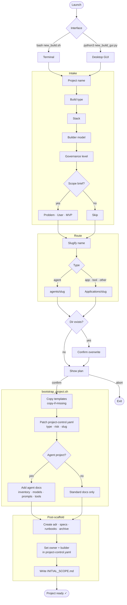

# User Guide

This guide covers how to use the framework day-to-day: creating projects, validating governance, customising templates, and understanding what each file does.

---

## Agent flow



---

## Creating a new project

### Terminal (any platform)

```bash
bash automation/new_build.sh
```

The launcher walks you through six questions:

1. **Project name** — free text. The directory name is auto-derived (lowercased, spaces become dashes).
2. **Build type** — `app`, `agent`, `tool`, or `other`.
3. **Expected stack** — free text, e.g. `python / fastapi` or `not specified`.
4. **Primary builder model** — `claude`, `codex`, `local`, or `hybrid`. Recorded in `project-control.yaml` and `INITIAL_SCOPE.md`.
5. **Governance level** — `normal` maps to `medium` risk tier; `heavy` maps to `high`.
6. **Capture scope brief?** — if `yes`, you answer three more questions (problem, primary user, MVP) and the answers are written into `INITIAL_SCOPE.md`.

Before creating anything, the launcher shows you a confirmation summary. Type `no` to abort with no changes made.

### Desktop GUI (Linux)

```bash
python3 automation/new_build_gui.py
```

Same questions as the terminal version, with a live path preview beneath the project name field. The output panel streams bootstrap progress in real time.

---

## What gets created

Every project receives:

| File | Purpose |
|------|---------|
| `README.md` | Project description (from template — fill in) |
| `CLAUDE.md` | Instructions loaded by Claude at the start of every session |
| `AGENTS.md` | Rules for multi-agent coordination |
| `AI_BOOTSTRAP.md` | Canonical project rules for any AI assistant — fill in the Commands section |
| `INITIAL_SCOPE.md` | Intake answers, classification, and first-session checklist |
| `project-control.yaml` | Risk tier, owner, project type, and required controls |
| `docs/architecture.md` | Architecture overview |
| `docs/risks/risk-register.md` | Risk log |
| `docs/CHANGELOG.md` | Change history |
| `docs/adr-template.md` | Template for Architecture Decision Records |
| `docs/exception-record-template.md` | Template for documenting governance exceptions |
| `scripts/governance-preflight.sh` | Local validation script |

For `app`, `tool`, and `other` projects (anything deployable):

| File | Purpose |
|------|---------|
| `docs/deployment-guide.md` | Deployment steps and rollback procedure |
| `docs/runbook.md` | Operational runbook |

For `agent` projects, also:

| File | Purpose |
|------|---------|
| `docs/agent-inventory.md` | What the agent does and its boundaries |
| `docs/model-registry.md` | Models in use, versions, purposes |
| `docs/prompt-register.md` | Prompts used, their inputs/outputs, owners |
| `docs/tool-permission-matrix.md` | Tools the agent can call and under what conditions |

---

## First steps after creation

Open `INITIAL_SCOPE.md`. It has a checklist:

- [ ] Fill in the `## Commands` section of `AI_BOOTSTRAP.md` (install, dev, lint, build, test commands)
- [ ] Confirm the risk tier in `project-control.yaml` — the default is `medium`
- [ ] Add a first ADR if you made architecture decisions during intake
- [ ] Run `bash scripts/governance-preflight.sh`

The `AI_BOOTSTRAP.md` Commands section is the most important thing to fill in before your first AI session. Without it, the AI has to guess how to build, test, and run the project.

---

## Adding governance to an existing project

Run `bootstrap_project.sh` directly against any existing directory:

```bash
bash automation/bootstrap_project.sh /path/to/existing-project application medium
```

It uses a **copy-if-missing** pattern — it will never overwrite files that already exist. Run it safely on a project that already has a `README.md` or `project-control.yaml`; only the missing files will be added.

Project types: `application` `website` `service` `internal-tool` `automation` `infrastructure` `documentation` `agent`

Risk tiers: `low` `medium` `high` `critical`

---

## Validating a project

### Quick check (file presence only)

```bash
bash automation/check_required_files.sh /path/to/project
```

Reports which required files are present or missing.

### Full governance check

```bash
bash automation/governance_check.sh /path/to/project
```

Checks required files, validates `project-control.yaml` fields, and reports any gaps.

### Per-project preflight

Each scaffolded project includes its own preflight script:

```bash
bash /path/to/project/scripts/governance-preflight.sh
```

Run this before significant changes or as a pre-commit hook.

---

## Understanding project-control.yaml

This file is the single source of truth for a project's governance classification. Key fields:

```yaml
project:
  name: my-app
  project_type: application   # application | website | service | internal-tool |
                              # automation | infrastructure | documentation | agent
  risk_tier: medium           # low | medium | high | critical

owner:
  name: Your Name

technical_lead:
  name: claude session        # or codex, local, hybrid

agent_controls:
  applicable: false           # set to true for agent projects
  autonomy_level: A0          # A0 = human-in-the-loop, A1 = supervised, A2 = autonomous
```

Change `risk_tier` if the project evolves. A prototype that becomes a production system should move from `medium` to `high` or `critical`, which implies tighter controls and a fuller document set.

---

## Recording an exception

When you knowingly deviate from the framework — skipping a document, using a non-standard structure, deferring a security control — record it instead of silently ignoring it.

Copy `docs/exception-record-template.md`, fill it in, and save it as `docs/exceptions/YYYY-MM-DD-short-title.md`.

An exception record needs:
- What was deviated from
- Why the deviation is justified
- Who approved it
- When it will be resolved (or that it's permanent)

---

## Customising templates

Templates live in `templates/project/`. Edit them to match your organisation's defaults before bootstrapping new projects.

Common customisations:

- **`AI_BOOTSTRAP.template.md`** — add default commands for your typical stack
- **`CLAUDE.template.md`** — add project-wide rules you always want Claude to follow
- **`project-control.template.yaml`** — change the default owner name, autonomy level, or risk tier
- **`docs/architecture.template.md`** — add sections specific to your architecture patterns

Changes to templates only affect new projects. Existing projects are unaffected.

---

## Risk tiers

| Tier | Typical use | What it implies |
|------|------------|----------------|
| `low` | Throwaway scripts, personal tools | Minimal documentation, no formal release process |
| `medium` | Internal tools, non-critical apps | Standard document set, basic testing required |
| `high` | Production apps, customer-facing systems | Full document set, security review, release checklist |
| `critical` | Infrastructure, auth, payment systems | All controls active, formal approval required for changes |

The framework doesn't enforce tier-specific rules automatically (yet) — the tier is a signal to the team and the AI about how carefully to proceed.

---

## Working with AI assistants

### Claude

`CLAUDE.md` is automatically read at the start of every Claude session in the project directory. It points Claude to `AI_BOOTSTRAP.md` as the canonical rule file.

`AI_BOOTSTRAP.md` is where you put:
- The actual commands to install, run, test, and build the project
- Any project-specific rules (e.g. "never modify the migrations directly")
- A pointer to `project-control.yaml` for risk context

### Other assistants (Codex, Cursor, etc.)

`AGENTS.md` covers multi-agent coordination rules. `AI_BOOTSTRAP.md` is written to be read by any assistant, not just Claude. Point your assistant's configuration at `AI_BOOTSTRAP.md` at the start of each session.

---

## Governance maturity path

The framework is designed to grow in layers:

| Layer | Description |
|-------|-------------|
| 1. Templates | ✅ Done — all projects start with a consistent structure |
| 2. Local validation | ✅ Done — `governance_check.sh` and `governance-preflight.sh` |
| 3. CI enforcement | Add `governance_check.sh` as a CI step |
| 4. Schema validation | Validate `project-control.yaml` against a schema |
| 5. Metrics and drift | Track which projects are missing controls over time |
| 6. Governing agent | AI-assisted compliance scoring and exception expiry reminders |

Start at layer 1 and add layers as the team grows or risk increases.
